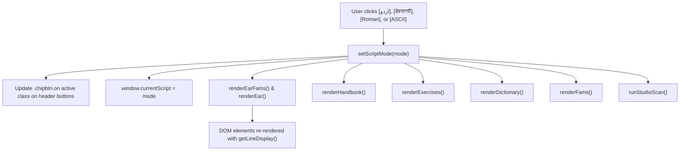

# Urdu Meter (بحر / Baḥr) Interactive Handbook & Studio: Comprehensive Project Handoff

> **Target Audience**: Any AI agent or developer continuing work on this repository.
> **Date**: September 2026
> **Workspace**: `/Users/vishalk/personal-repo/urdu-bahr`

---

## 1. Executive Summary & Architectural Philosophy

This project is a complete, scholarly, and interactive platform for learning, scanning, reciting, and composing Urdu poetry according to the classical Arabic-Persian-Urdu prosodic system (*ʻIlm-e-ʻArūz* / علم عروض), based directly on **Frances W. Pritchett & Khawaja Ahmad Khaliq Anjum's** landmark work *Urdu Meter: A Practical Handbook* (1987; Columbia University web edition) and incorporating **A. Sean Pue's** AST graph transliteration engine (*A Desertful of Roses*).

### Non-Negotiable Architectural Invariants
1. **100% Self-Contained Standalone Web Application**:
   - The production app is delivered as a single standalone HTML file: [`index.html`](file:///Users/vishalk/personal-repo/urdu-bahr/index.html).
   - **Zero external network requests** at runtime (no external CDNs, fonts, CSS frameworks, or JavaScript CDNs).
   - Audio synthesis uses browser-native Web Audio API oscillators, bandpass filters, envelope generators, and noise buffers (no external MP3/WAV assets).
2. **Strict Dual-File Mirroring**:
   - [`index.html`](file:///Users/vishalk/personal-repo/urdu-bahr/index.html) and [`urdu-meter-trainer 2.html`](file:///Users/vishalk/personal-repo/urdu-bahr/urdu-meter-trainer%202.html) must remain **100% byte-for-byte identical** (verified by SHA-256 hash).
   - Never edit one without compiling via [`scripts/build_app.py`](file:///Users/vishalk/personal-repo/urdu-bahr/scripts/build_app.py), which automatically writes both files identically.
3. **Execution Tooling**:
   - All Python scripts must be executed using `uv run python <script>`.

---

## 2. Directory & File Map

```
urdu-bahr/
├── index.html                          # Primary standalone production app
├── urdu-meter-trainer 2.html           # Exact byte-for-byte mirror of index.html
├── test_runtime.py                     # 6-phase rigorous verification suite
├── PROJECT_HANDOFF.md                  # This developer handoff documentation
│
├── data/                               # Structured JSON datasets
│   ├── handbook_verbatim.json          # Unabridged text of Chapters 0–8 (184,800+ chars)
│   ├── exercises_verified.json         # 24 classical ghazals, 113 couplets, 226 lines
│   ├── meters_catalog.json             # 37 classical meters + ruba'i variants + Mir's Hindi
│   ├── dictionary_expanded.json        # 300+ prosodically annotated Urdu words
│   └── bibliography.json               # Focused scholarly citations (Pritchett & Pue)
│
├── source_data/                        # Raw source HTML from Frances Pritchett's website
│   ├── 00_intro.html ... 08_eyetoear.html  # Handbook chapters 0–8
│   ├── 09_bib.html                     # Original handbook bibliography
│   ├── 10_ex_01_06.html ... 10_ex_19_24.html # 24 Ghazal exercise couplets
│   └── 11_exnotes.html                 # Chapter 11 scansion notes and answer keys
│
├── pritchett_scripts/                  # Sean Pue AST graph transliteration engine
│   ├── ghalib.js                       # AST Graph traversal & parser runtime
│   ├── urdu_parser_data.js             # Graph rules for Urdu Nastaliq generation
│   ├── devanagari_parser_data.js       # Graph rules for Devanagari generation
│   └── diacritics_parser_data.js       # Graph rules for Roman ALA-LC diacritics
│
├── scripts/                            # Build & data extraction scripts
│   ├── build_app.py                    # Master bundler & compiler script
│   ├── build_audited_exercises.js      # Ghazal extraction & verification script
│   └── build_handbook_data.py          # Handbook verbatim extraction script
│
└── scratch/                            # Diagnostic & testing scripts
    ├── test_ear_cdp.js                 # Chrome CDP test for Ear tab script switcher
    └── test_all_tabs_cdp.js            # Chrome CDP test verifying all tabs
```

---

## 3. Core Features & Capabilities

### 3.1. Multi-Script Transliteration Engine (Sean Pue AST Graph)
- **Embedded Engine**: Inlined directly into `index.html` without external runtime dependencies.
- **Supported Scripts**:
  - `ur`: Urdu in Nastaliq typography (`Jameel Noori Nastaleeq`, `Noto Nastaliq Urdu`, RTL layout).
  - `hi`: Devanagari script (देवनागरी).
  - `ro`: Formal scholarly Romanization with ALA-LC diacritics (`ā`, `ī`, `ū`, `ḥ`, `ṣ`, `ẓ`, `ṭ`, `ʿ`, `ġ`, `ḳh`, `ñ`, etc.).
  - `ascii`: Frances Pritchett's canonical ASCII input scheme (e.g., `dil-e naadaa;N tujhe hu))aa kyaa hai`).
- **Global Header Switcher**:
  - Four tactile chip buttons (`[اردو]`, `[देवनागरी]`, `[Roman]`, `[ASCII]`) pinned in the header.
  - Active button highlights in solid gold (`var(--gold)`) with drop shadow and `cursor: pointer`.
  - Dynamically updates active verse displays across **all 10 application tabs** in real time.
- **Lookup & Transliteration Strategy (`getLineDisplay`)**:
  1. Checks `KNOWN_VERSES` index (which indexes all 226 exercise lines and 25 family couplets across all 4 representations).
  2. If novel input:
     - Devanagari → normalized ASCII → Sean Pue graph parse → Urdu Nastaliq or Roman.
     - Roman → normalized ASCII → Sean Pue graph parse → Urdu or Devanagari.
     - Urdu → Sean Pue graph parse → Devanagari or Roman diacritics.

### 3.2. Verbatim Unabridged Handbook (Chapters 0–8)
- Accessible via the **📖 Handbook** navigation tab.
- Contains the unabridged text of Frances W. Pritchett & Kh. A. Khaliq Anjum's *Urdu Meter: A Practical Handbook*:
  - **Chapter 0**: *Introduction* (Online & print editions context).
  - **Chapter 1**: *General Rules* (Letters vs. sounds, syllable definitions, silent letters).
  - **Chapter 2**: *Flexibility* (Two-syllable flexibility, short `vāv`, vowels before `h`, *nun-e ghunnah*).
  - **Chapter 3**: *Special Constructions* (*Iẓāfat*, *vāve ʻat̤f*, Arabic *al-*, Persian prefixes).
  - **Chapter 4**: *Irregular Words* (Word lists, metric doublets, common traps).
  - **Chapter 5**: *Metrical Feet* (*Afāʻīl*, Arabic mnemonic foot names).
  - **Chapter 6**: *Meters & Bahrs* (The 37 standard meters, 10 families, Hindi meter).
  - **Chapter 7**: *Scanning as Code-Breaking* (Methodology of scansion, eliminating meters).
  - **Chapter 8**: *From Eye to Ear* (Auditory prosody, vocalization, recitation traditions).
- Features chapter selector chips, internal anchor jump navigation, and bilingual chapter headers.

### 3.3. 100% Audited Classical Ghazal Exercises (Chapters 10 & 11)
- Accessible via the **🎯 Exercises** tab.
- Covers all **24 classical ghazals** from Vali Dakhani to Muhammad Iqbal:
  - 100% of all couplets (113 couplets / 226 lines total) fully verified and extracted.
  - Every couplet line includes four synchronized transliterations (`ur`, `hi`, `ro`, `ascii`).
  - Pritchett's introductory meter commentary and per-verse scansion notes (from `source_data/11_exnotes.html`) attached to each couplet.
  - **"Scan in Studio" button**: One-click transfer of any couplet into the Poet's Studio.
  - **"Play Rhythm" button**: Auditory rhythm playback of the couplet's metrical cadence.

### 3.4. Poet's Interactive Studio & Couplet Stacking Engine
- Accessible via the **✍ Studio** tab.
- Allows user to type or paste single lines, couplets (*sher*), or multi-line stanzas in Urdu, Devanagari, or Roman transliteration.
- **Couplet Stacking & Paired Meter Logic**:
  - Automatically identifies whether both lines (*misras*) share a single classical meter or belong to classical **paired meters** (*mutanāsiq / murakkab*, e.g., meters `#14` ↔ `#15`, or `#33` ↔ `#34`, where an penultimate long syllable `-` splits into two short syllables `= =`).
  - Visual Couplet Verdict banner with cost rating (`PERFECT`, `GOOD FIT`, `STRAINED`, or `NO MATCH`).
- **Granular Syllable Scansion Cards**:
  - Color-coded syllable breakdown cards showing syllable text, metrical weight (`=` for long, `–` for short, `c` for cheat/overlong), and romanized foot syllables.
  - Detection of prosodic flexibilities (*iẓāfat*, *tashdīd*, short/long vowels, grafted syllables).
- **Sequential Recitation**: Chained Web Audio playback reciting misra 1, pausing for breath, and reciting misra 2.

### 3.5. 37 Classical Meters & Arab Prosody Catalog
- Accessible via the **≋ Meters** tab.
- Displays all 37 classical meters organized by Arabic prosodic families:
  - *Hazaj* (ہزج), *Rajaz* (رجز), *Ramal* (رمل), *Khafif* (خفیف), *Muzāriʻ* (مضارع), *Munsarih* (منسرح), *Mujtass* (مجتث), *Sariʻ* (سریع), *Mutaqārib* (متقارب), *Mutadārak* (متدارک).
  - Plus 24 classical *Rubāʻī* variations and Mir Taqi Mir's Hindi meter.
- Displays Arabic technical names (e.g. `Hazaj musamman sālim`), foot configurations (`mafāʻīlun mafāʻīlun...`), caesura boundaries (`//`), and famous couplets.
- `meterLabel(m)` helper guarantees authentic titles across the application without returning `null`.

### 3.6. ♫ Ear & Auditory Training
- Accessible via the **♫ Ear** tab (default landing view).
- Allows auditory looping of individual metrical feet ("cells") and full lines.
- Visual rhythm playback with real-time flashing block nodes (`.blk.lit`).
- Family selector chips and famous verses switch dynamically with the global script switcher.
- Adaptive drills ("Which Tune?", "In or Limping?", "Echo Tapping") track learning history and focus practice on meters user struggles with.

### 3.7. Prosodic Dictionary
- Accessible via the **📚 Dictionary** tab.
- 300+ classical Urdu words categorized into:
  - Flexible words (`x` / metrically variable).
  - Persian loanwords and compound rules.
  - Indic / Hindi inherited vocabulary.
- Live search bar and tag filtering with rhythmic audio demonstration for each word.

### 3.8. Scholarly Bibliography & Attributions
- Accessible via the **📜 Bibliography** tab.
- Clean 2-card academic citation layout exclusively crediting:
  1. **Frances W. Pritchett & Khawaja Ahmad Khaliq Anjum**: *Urdu Meter: A Practical Handbook* (1987; Columbia University).
  2. **A. Sean Pue**: *A Desertful of Roses* AST Graph Transliteration Engine (Columbia University / Michigan State University).

---

## 4. Implementation Details & Architecture

### 4.1. Global Script Switching Flow



#### Transliteration Helper (`getLineDisplay`)
Located in [`scripts/build_app.py`](file:///Users/vishalk/personal-repo/urdu-bahr/scripts/build_app.py):
```javascript
function getLineDisplay(lineObj, script) {
  if(!lineObj) return '';
  if(typeof lineObj === 'string') {
    const nk = normVerseKey(lineObj);
    if(KNOWN_VERSES[nk]) return getLineDisplay(KNOWN_VERSES[nk], script);
    if(script === 'ur') return lineObj;
    if(script === 'hi') return urduToDevanagari(lineObj);
    if(script === 'ro') return urduToRoman(lineObj);
    return lineObj;
  }
  if(script === 'ascii') return lineObj.ascii || lineObj.ro || lineObj.ur || '';
  if(script === 'hi') return lineObj.hi || urduToDevanagari(lineObj.ur) || lineObj.ascii || '';
  if(script === 'ro') return lineObj.ro || urduToRoman(lineObj.ur) || lineObj.ascii || '';
  return lineObj.ur || lineObj.ascii || '';
}
```

### 4.2. Web Audio Synthesis Architecture
The rhythm audio playback engine is implemented with pure Web Audio API:
- **Audio Context**: `A.ctx = new (window.AudioContext || window.webkitAudioContext)()`.
- **Timbres**:
  - `dum·da`: Dual sine wave synth with pitch ramp (low `dum` = 65 Hz dropping to 58 Hz; crisp `da` = 130 Hz).
  - `tabla`: Tuned membrane simulation with resonant bandpass filter (Dayan ringing at 300 Hz and 1700 Hz; Bayan modulating 72 Hz → 104 Hz).
  - `oud`: Plucked string simulation with decaying harmonics.
  - `wood`: Percussive click with exponential decay.
- **Sequencing & Chaining**:
  `play(seq, opts)` schedules notes with sub-millisecond precision. When reciting a couplet in Studio, line 1 is played, triggers `onEnd`, delays 400ms, and plays line 2.

### 4.3. Couplet Stacking & Paired Meter Detection
Located in `runStudioScan()` in [`scripts/build_app.py`](file:///Users/vishalk/personal-repo/urdu-bahr/scripts/build_app.py):
- Classical Urdu meters permit paired forms within a single ghazal:
  `const PAIRS = [[1, 9], [14, 15], [16, 17], [18, 19], [33, 34]];`
- When multiple lines are evaluated, the algorithm tests all standard meter groups, pairing candidates, and Mir's Hindi meter, finding the minimal-cost common fit across all misras.

---

## 5. Verification & Testing Suite

The repository contains an automated test suite in [`test_runtime.py`](file:///Users/vishalk/personal-repo/urdu-bahr/test_runtime.py), run via:
```bash
uv run python test_runtime.py
```

### Test Phases Covered
1. **Verbatim Handbook Content**: Validates all 9 chapters (0–8) exist in full, verifying char counts (>180,000 chars total) and ensuring zero truncation.
2. **100% Audited Ghazal Exercises**: Verifies 24 ghazals, exactly 113 couplets, 226 lines, non-empty transliterations across all 4 scripts, and 100% note coverage.
3. **Sean Pue AST Transliteration**: Verifies multi-script conversion between Urdu, Devanagari, and Roman diacritics.
4. **Deep Sandbox Scansion & Studio**: Tests `meterLabel`, paired meter scansion, multi-script input scanning, and sequential audio chaining.
5. **Standalone Integrity & File Mirroring**: Verifies `index.html` and `urdu-meter-trainer 2.html` are identical byte-for-byte with zero external network CDN dependencies.
6. **Bibliography & Switcher Integrity**: Verifies focused 2-entry academic citations and header script switcher markup.

---

## 6. Guide for Future Agents

### Rule 1: Never Manually Edit `index.html` Alone
[`index.html`](file:///Users/vishalk/personal-repo/urdu-bahr/index.html) is generated by [`scripts/build_app.py`](file:///Users/vishalk/personal-repo/urdu-bahr/scripts/build_app.py).
If you need to make changes:
1. Edit the relevant generator logic or component in [`scripts/build_app.py`](file:///Users/vishalk/personal-repo/urdu-bahr/scripts/build_app.py) or `data/*.json`.
2. Run `uv run python scripts/build_app.py`.
3. Verify both files mirrored and tests pass with `uv run python test_runtime.py`.

### Rule 2: Preserving Multi-Script Synchronization
When adding verses or modifying templates, always use:
```javascript
const disp = getLineDisplay(lineObj, currentScript);
const isRtl = (currentScript === 'ur');
```
Ensure Urdu text uses `font-family: 'Jameel Noori Nastaleeq', 'Noto Nastaliq Urdu', serif; direction: rtl;`, while Devanagari and Roman use LTR fonts.

### Rule 3: Preserving Offline Standalone Purity
Do not import external `<script src="https://...">` or `<link href="https://...">`. All icons, fonts, stylesheets, and algorithms must remain inline within the HTML file.
